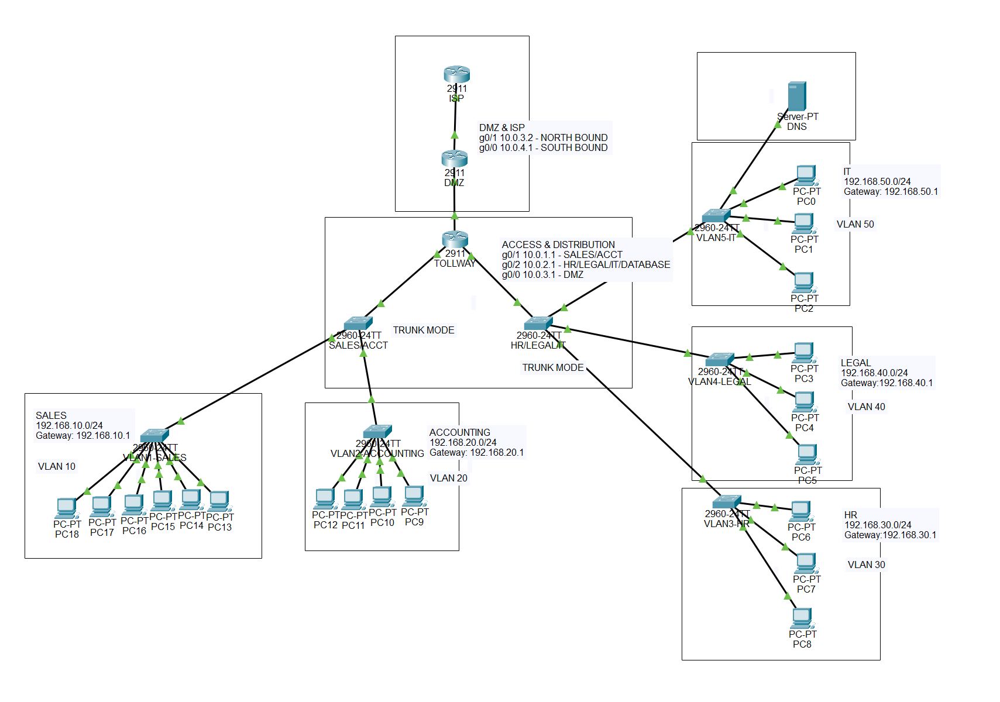
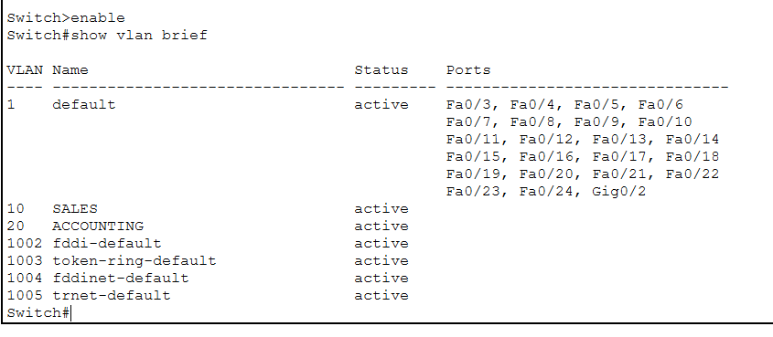
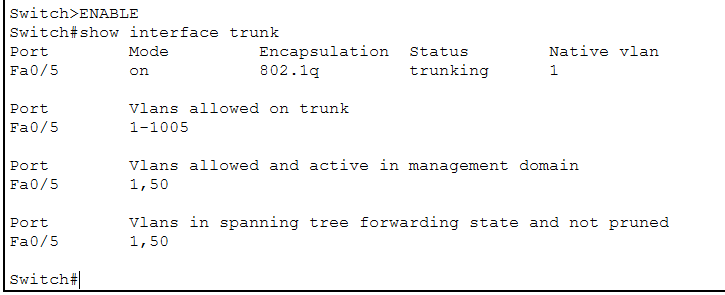
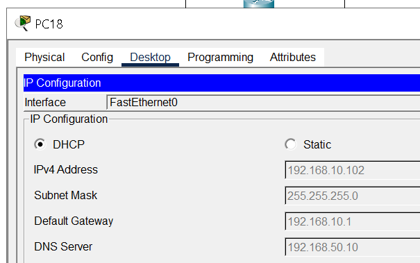
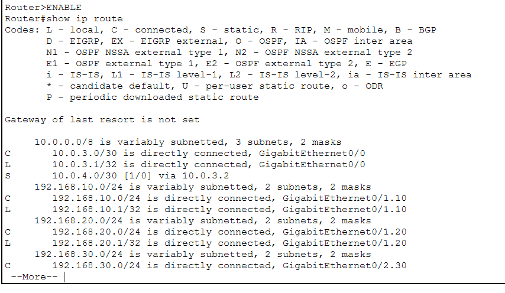
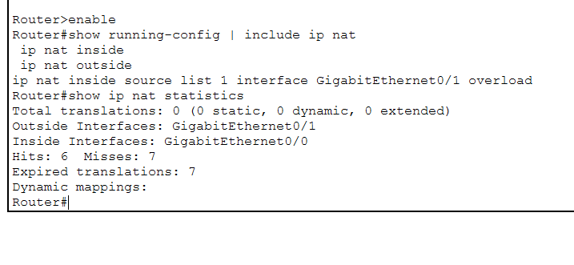
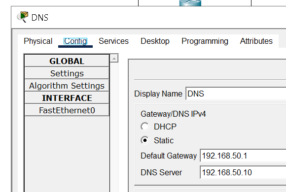
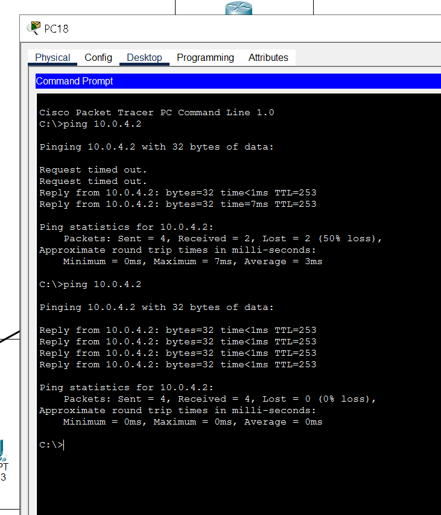

# Packet Tracer Enterprise Network

## Overview

This project simulates a small enterprise network in Cisco Packet Tracer. The environment includes multiple departments segmented by VLANs, inter-VLAN routing, DHCP addressing, DNS services, NAT/PAT, trunk links, and routed connectivity through a DMZ/ISP path.

The goal of this lab was to practice core Network+ and help desk/SOC-relevant networking concepts in a realistic enterprise-style topology.

## Network Topology

## Key Features

- Department-based VLAN segmentation
- Router-on-a-Stick inter-VLAN routing
- DHCP pools for each department subnet
- DNS server configuration and client name resolution
- Trunk links between switches and routing devices
- NAT/PAT through the DMZ router toward the simulated ISP
- End-to-end connectivity testing between clients, gateways, DNS, and upstream routers

## VLAN and IP Addressing

| Department | VLAN | Subnet | Default Gateway |
|---|---:|---|---|
| Sales | 10 | 192.168.10.0/24 | 192.168.10.1 |
| Accounting | 20 | 192.168.20.0/24 | 192.168.20.1 |
| HR | 30 | 192.168.30.0/24 | 192.168.30.1 |
| Legal | 40 | 192.168.40.0/24 | 192.168.40.1 |
| IT | 50 | 192.168.50.0/24 | 192.168.50.1 |

## Validation Screenshots

### VLAN Configuration

### Trunk Configuration

### DHCP Configuration

### Routing Table

### NAT/PAT Configuration

### DNS Server Proof

### Successful Connectivity Test

## Configuration Files

Device configurations are included in the `configs/` folder:

- `router-configs.txt`
- `switch-configs.txt`

## Skills Demonstrated

- VLAN creation and switchport assignment
- 802.1Q trunking
- Router-on-a-Stick configuration
- DHCP scope configuration
- DNS server setup
- Static/default routing
- NAT/PAT configuration
- Network troubleshooting and validation
- Documentation of network design and testing evidence
